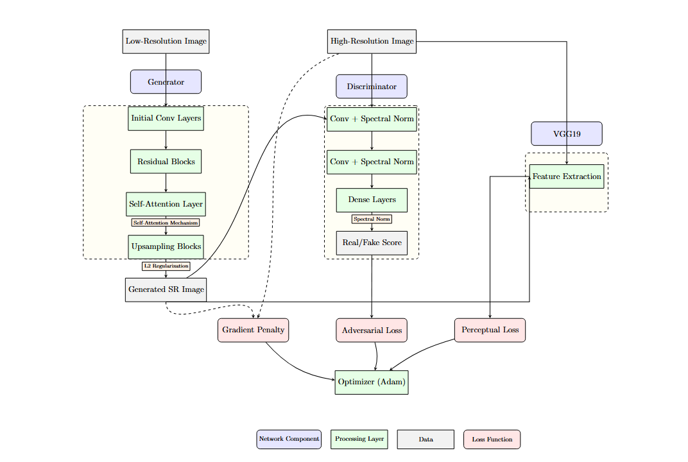

# WCGANS_GP for Super-Resolution of Medical Images

**Authors:** Pravinkumar Gohil, Satwik Chauhan, Zeeshan Modi  
---

## Table of Contents

- [Project Overview](#project-overview)
- [System Architecture](#system-architecture)
- [Model Components](#model-components)
- [Dataset & Preprocessing](#dataset--preprocessing)
- [Training Details](#training-details)
- [Evaluation Metrics](#evaluation-metrics)
- [Results & Visualizations](#results--visualizations)
- [How to Use](#how-to-use)
- [Adding Images & Diagrams](#adding-images--diagrams)
- [Hardware & Software Requirements](#hardware--software-requirements)
- [References](#references)

---

## Project Overview

This project implements a **Wasserstein Conditional GAN with Gradient Penalty (WCGANS_GP)** for medical image super-resolution, focusing on chest X-ray images. The model aims to reconstruct high-resolution (HR) images from low-resolution (LR) inputs, preserving critical anatomical and pathological details necessary for clinical diagnosis.

Key innovations include:
- **Wasserstein loss with gradient penalty** for stable GAN training.
- **Self-attention** and **spectral normalization** to preserve global and local features.
- **Perceptual loss** using VGG19 to maintain perceptual and diagnostic fidelity.

---

## System Architecture

The overall workflow is as follows:

- **Input:** Low-resolution and high-resolution images.
- **Generator:** Upscales LR images to HR using initial convolution, residual blocks, self-attention, and upsampling.
- **Discriminator:** Distinguishes real HR from generated SR images using convolutional layers with spectral normalization.
- **VGG19 Feature Extractor:** Computes perceptual loss for realistic texture/detail.
- **Losses:** Wasserstein loss, gradient penalty, and perceptual loss are combined and optimized via Adam.

### Architecture Diagram


**Feature Extractor:**
- Pre-trained VGG19 (ImageNet) with frozen layers
- Extracts perceptual features for loss computation

**Loss Functions:**
- **Wasserstein Loss:** For stable adversarial training
- **Gradient Penalty:** Enforces Lipschitz constraint
- **Perceptual Loss:** Ensures perceptual similarity to HR images

---

## Dataset & Preprocessing

- **Dataset:** Chest X-Ray Pneumonia dataset (or similar)
- **Preprocessing:**
  - HR images resized to 256x256x3
  - LR images downsampled to 64x64x3
  - Normalization to [-1, 1]
  - Random horizontal flips for augmentation

---

## Training Details

- **Optimizer:** Adam (learning rate = 0.0002, β1 = 0.5)
- **Batch Size:** 16
- **Epochs:** Up to 1000 (or as per requirement)
- **Training Loop:**
  - Train discriminator with real and fake images + gradient penalty
  - Train generator using adversarial and perceptual loss
  - Metrics (PSNR, SSIM, losses) recorded per epoch

Example training log snippet:
```
Epoch 700/1000 - d_loss: 9.6799 - g_loss: 0.1805 - PSNR: 26.44 - SSIM: 0.78
```


---

## Evaluation Metrics

- **Peak Signal-to-Noise Ratio (PSNR):** Measures reconstruction quality (higher is better)
- **Structural Similarity Index (SSIM):** Measures perceptual similarity (higher is better)
- **Loss Curves:** Discriminator and generator loss over epochs

---

## Results & Visualizations

### Model Block Diagram

![System Desi
*Figure: Detailed block diagram of generator, discriminator, and loss connections*[3]

### Training Progress

![PSNR Progss
*Figure: PSNR improvement over epochs*[4]

### Output Samples Across Epochs

![Generated Images Across Epoc
*Figure: SR outputs at different epochs with PSNR/SSIM values*[5]

### Final Output Comparison

| Low Resolution | Generated (PSNR) | Original High Resolution |
|:--------------:|:----------------:|:-----------------------:|
| *

---

## How to Use

### Installation

```bash
git clone https://github.com/yourusername/WCGANS_GP-Medical-SR.git
cd WCGANS_GP-Medical-SR
pip install -r requirements.txt
```

### Training

Edit paths in the notebook or script:
```python
TRAIN_PATH = '/path/to/train/'
VAL_PATH = '/path/to/val/'
TEST_PATH = '/path/to/test/'
```

Run the main training script or notebook:
```python
python X3_WC.ipynb
```

### Inference

Use the trained generator to upscale new LR images:
```python
sr_image = generator.predict(lr_image)
```

### Visualization

After training, run:
```python
visualize_results(generator, discriminator, losses, test_images=test_images)
```
This will save and display training curves and output comparisons.

---

## Adding Images & Diagrams

To include your own images or diagrams in the README:

1. **Save images in your repo** (e.g., `images/architecture.png`).
2. **Reference in Markdown:**
   ```markdown
   
   ```
3. **For side-by-side or grid layouts, use HTML:**
   ```html
   
     
       
       
       
     
     
       Low Resolution
       Super-Resolved
       High Resolution
     
   
   ```
4. **For diagrams/flowcharts:** Export from draw.io, Lucidchart, or similar, then embed as above.

---

## Hardware & Software Requirements

**Hardware:**
- Multi-core CPU (≥3 GHz)
- NVIDIA GPU with CUDA support, ≥8GB VRAM recommended
- 16GB+ RAM
- SSD storage

**Software:**
- OS: Windows 10/11, Ubuntu, or macOS
- Python 3.7+
- TensorFlow 2.x, Keras 3.5.0
- OpenCV, scikit-image, Pillow, matplotlib, etc.
- Jupyter Notebook or preferred IDE

---

## Acknowledgements

This work was completed as part of the B.E. in Computer Science (AI & ML) at Chandigarh University, with thanks to our supervisor and department for support.

---

**For any questions, please open an issue or contact the authors.**

---
